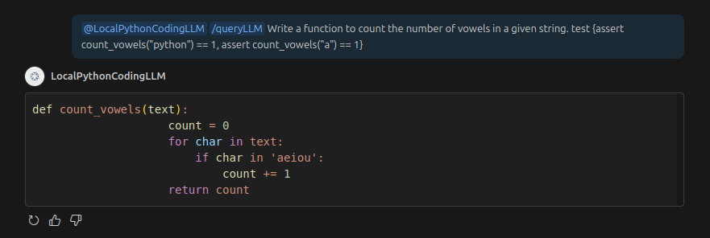

# LocalPythonCodingLlm 

This extensision runs a LLM model locally with python.You can query it in the Chatwindow.

## Example usage

## Features
- offline 
- no data collection
- open source 
- unlimited queries

keep in mind: Chatgpt/Copilot will be more accurate, since they have more processing power etc ...

## Requirements
- python in the PATH
- github.copilot-chat extension in VSC
- a gpu with CUDA is strongly recommended,otherwise the LLM will be very slow.

###
Disclaimer: This extension generates code automatically. You are solely responsible for reviewing and testing any output before using it in production. No warranty is provided.

## Issues

please report issues to https://github.com/manuel-Oelmaier/LocalPythonCodingLlm/issues

## Release Notes

### 0.0.1 extension release

